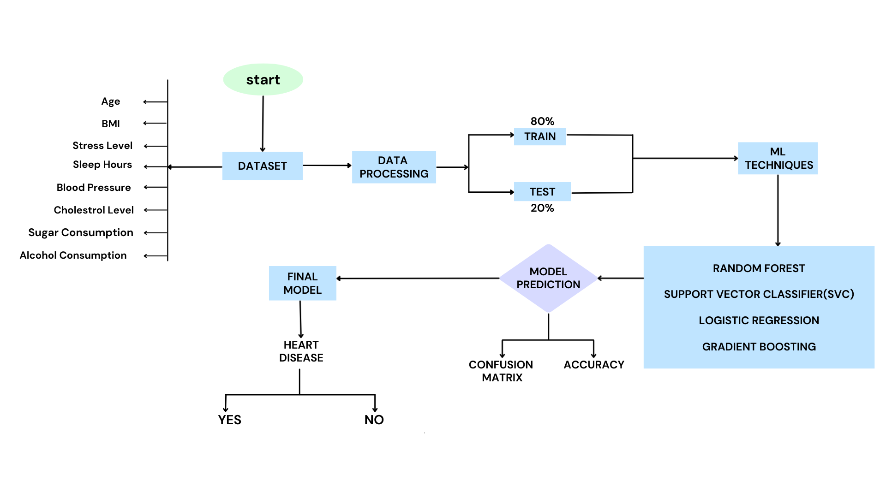

# 🩺 Disease Prediction System Using Machine Learning

This project predicts the likelihood of a disease based on multiple symptoms entered by the user.  
It uses **Machine Learning models (SVC & RandomForest)** and provides **diet**, **medicine**, and **workout recommendations** based on the predicted disease.

The frontend is built using **Streamlit**, offering a clean and interactive user interface.

---

## 📌 Features

✔ Users can enter **multiple symptoms**  
✔ Predicts disease using ML models  
✔ Provides **diet plan**, **medicine suggestions**, and **workout recommendations**  
✔ Visualized evaluation using **confusion matrix & accuracy**  
✔ Streamlit-based user interface  
✔ Backend powered by **Random Forest** and **Support Vector Classifier (SVC)**  

---

## 🧠 Machine Learning Workflow

The following diagram represents the end-to-end process used in the project:



### **Workflow Summary**
1. **Dataset** collected with features with different symptoms  

2. **Data Processing**  
   - Cleaning  
   - Encoding  
   - Normalization  
   - Splitting (80% train / 20% test)

3. **Model Training**  
   Algorithms used:
   - Support Vector Classifier (SVC)
   - Random Forest Classifier
   - Logistic Regression (experimented)
   - Gradient Boosting (experimented)

4. **Model Evaluation**  
   - Confusion Matrix  
   - Accuracy Score  

5. **Final Prediction**  
   ● Output: **Heart Disease — Yes / No**  
   ● Plus actionable recommendations:  
     - Diet  
     - Medicine  
     - Workouts  

---

## 🛠️ Tech Stack

### **Languages & Libraries**
- Python  
- Pandas  
- NumPy  
- Scikit-learn  
- Streamlit  

### **Models Used**
- **SVC (Support Vector Classifier)**
- **Random Forest Classifier**

---

## 🚀 How to Run the Project Locally

### **1. Clone the Repository**
```bash
git clone https://github.com/Developersubham18/ML-diseasePrediction.git
cd ML-diseasePrediction
